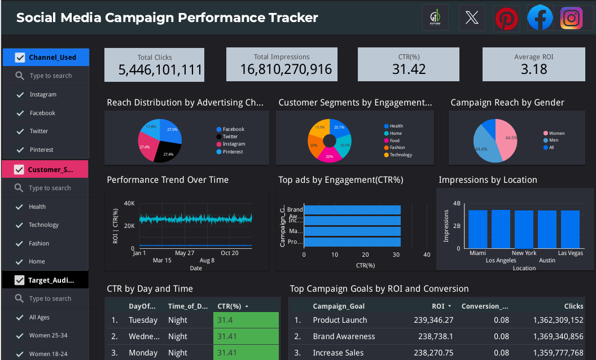

# 📊 Social Media Campaign Performance Tracker

A data analytics project that explores the performance of real-world social media advertising campaigns using **Python**, **Google Looker Studio**, and **Power BI**. The goal is to uncover what drives user engagement, optimize conversion, and support data-driven marketing strategies.

---

## 📌 Project Objective

To analyze, visualize, and derive insights from a large social media advertising dataset by evaluating key performance metrics like **Click-Through Rate (CTR)**, **Return on Investment (ROI)**, **Conversion Rate**, and **Engagement Score** across various dimensions such as **Age**, **Time of Day**, **Location**, **Audience**, and **Platform**.

---

## 🛠 Tools & Technologies

- **Python** (Pandas, Seaborn, Matplotlib, Scikit-learn)
- **Google Looker Studio** (for dynamic dashboards)
- **Microsoft Power BI** (for business intelligence dashboards)
- **Jupyter Notebook**
- **Git & GitHub**

---

## 📂 Dataset Overview

- 📁 300,000 records of campaign-level data  
- 🎯 Campaign Metrics: Clicks, Impressions, CTR, Conversion Rate, ROI  
- 🧑‍🤝‍🧑 Demographics: Age group, Gender, Target Audience, Language  
- 🌍 Geographic: Location, Timezone, Day of Week  
- 🕒 Temporal: Timestamp, Hour, Time of Day  
- 📊 Behavioral: Engagement Score, Customer Segment  

---

## 🔧 Data Cleaning & Preparation

In Python:
- Converted data types for accurate processing
- Split and cleaned **Age group** into numeric values (`Age start`, `Age end`, `Age Midpoint`)
- Extracted **Hour**, **DayOfWeek**, and **Time_of_Day** from timestamps
- Created custom metrics like **CTR (%)**, **CPA (Cost Per Acquisition)**, and **Is_Weekend**
- Handled outliers and validated business logic

---

## 🤖 Predictive Modeling

Tried a **Random Forest Regressor** to predict **Conversion Rate** using campaign features.

- ⚠️ **Result**: Model performed poorly (R² ≈ -0.03), indicating weak predictive power in the dataset for that target.  
- ✅ Decision: Focused more on **exploratory data analysis** and **dashboarding**.

---

## 📊 Key Visualizations

### Google Looker Studio Dashboard:
- ✅ CTR by Age Group, Platform, Time of Day  
- ✅ ROI Distribution by Channel  
- ✅ Engagement Score by Audience Segment  
- ✅ Table for CTR by Day & Time  
- ✅ Pie Charts for Reach Distributions

### Power BI Dashboard:
- ✅ Map of campaign reach 
- ✅ Highlighted KPIs for Clicks, ROI, CTR, Conversion Rate  
- ✅ Drilldowns for platform performance and location-based analysis  

---

## 🔍 Key Insights

### 📊 Dashboard 1: Looker Studio – *“Social Media Campaign Performance Dashboard”*

#### ✅ Overall Campaign Metrics
- **Total Clicks:** 5.45 billion  
- **Total Impressions:** 16.81 billion  
- **Click-Through Rate (CTR):** 31.42%  
- **Average ROI:** 3.18  

#### 📈 Performance Over Time
- CTR (%) remained relatively stable across the year.
- ROI showed minimal variation, indicating consistent campaign returns.

#### 📌 Top Performing Channels
- **Reach by Channel:**  
  - **Instagram:** 27.4%  
  - **Pinterest:** 27.4%  
  - **Facebook:** 27.5%  
  - **Twitter:** 17.6%  

#### 🧑‍🤝‍🧑 Customer Segment Insights
- **Highest Engagement:**  
  - *Health* (21%)  
  - *Home* (20%)  
- **Gender Reach:**  
  - Women: 44.5%  
  - Men: 44.4%  
  - Unspecified: Remaining %

#### 🌎 Impressions by Location
- **Top Cities:**  
  - Miami  
  - Los Angeles  
  - New York  
  - Austin  
  - Las Vegas  
- Each received about **3B–4B impressions**.

#### 🕐 Time-based Performance
- **Top CTR Days & Times:**  
  - *Tuesday, Wednesday, and Monday nights* had the highest CTR (31.41%).

#### 🏆 Campaign Goal Effectiveness
- **Top Goals by ROI & Conversions:**  
  - *Product Launch:* Highest ROI  
  - *Brand Awareness* and *Increase Sales* followed closely.

---

### Dashboard 2: Power BI – *“Social Media Campaign Performance Tracker”*

#### 📊 Summary Metrics
- **Total Clicks:** 5 billion  
- **Average CTR:** 31.42%  
- **Average ROI:** 3.18  
- **Average Engagement Score:** 4.37  

#### 🌐 Platform Performance
- **Top Engagement Ads:**  
  - Instagram (0.41M)  
  - Facebook  
  - Twitter  
  - Pinterest (lowest)
- **CTR (%) by Platform:**  
  - *Twitter:* Highest  
  - *Pinterest:* Lowest

#### 📍 Reach Distribution
- **Map of Campaign Reach:**  
  - Campaigns covered all major global regions  
  - Stronger presence in *North America*, *Europe*, and *Asia*.

#### 🧑 Demographics
- **ROI by Age Group:**  
  - *Age 26–34* and *18–24* showed the highest ROI (~19.96%).

- **High-Performing Segments:**  
  - *All*

---

## 📁 Repository Structure

FUTURE_DS_02/
├── assets/
│ ├── PowerBI Dashboard.png # Preview image of Power BI dashboard
│ └── lookerstudio_report.png # Preview image of Looker Studio dashboard
├── Campaign_performance.ipynb # Python notebook for cleaning, EDA, and modeling
├── Dataset.zip # Enhanced dataset (CSV format inside)
├── Google_looker report.pdf # PDF version of Looker Studio dashboard
├── Task2 futureinterns_campaign performance.pbix # Power BI dashboard file
└── README.md # Project overview and documentation

---

## 🎥 Video Walkthrough

Watch the full demo and explanation of this project on [LinkedIn](#) *(https://www.linkedin.com/in/anjolaoluwa-adekomi-7b2548343/)*.

## 🔗 Live Dashboards

- [Google Looker Studio Report](https://lookerstudio.google.com/reporting/ae2acc7f-ef55-4724-acc8-182d680ead71/page/z7KTF) – Interactive dashboard showcasing campaign insights.
- [Power BI Dashboard (Image Preview)](assets/PowerBI%20Dashboard.png) – Full .pbix file is available for download in this repository.

---

## 🚀 What I Learned

- ✅ Cleaning and preparing large datasets for analysis  
- ✅ Translating business questions into analytical goals  
- ✅ Building compelling dashboards that communicate clear insights  
- ✅ Understanding limitations of predictive models

## 🧰 Tools Used

| Tool | Purpose |
|------|---------|
| 🐍 **Python (Pandas, NumPy, Seaborn, Matplotlib)** | Data cleaning, feature engineering, exploratory data analysis (EDA), and predictive modeling |
| 📊 **Google Looker Studio** | Creating dynamic, interactive dashboards and data stories |
| 📈 **Microsoft Power BI** | Visualizing key campaign metrics for business decision-making |
| 💻 **Jupyter Notebook** | Development environment for Python code |
| 📁 **Git & GitHub** | Version control and project collaboration |
| 📄 **PDF/PowerPoint** | Report and presentation export for stakeholders |

---

## ✅ Final Recommendations

1. **Optimize Ad Scheduling**  
   Run campaigns more frequently during high-performing time slots such as **night time** and **weekends**, when CTR is highest.

2. **Refine Targeting by Age & Platform**  
   Focus advertising efforts on **Instagram** and **Facebook** for **18–34 age groups**, which show higher engagement and ROI.

3. **Rethink Campaign Goals Strategy**  
   While "Increase Sales" campaigns have high ROI, they often underperform on engagement—suggesting the need to **balance goals between awareness and conversion**.

4. **Reduce Wasted Spend**  
   Pause or reevaluate campaigns with **low CTR** and **high CPA**, especially those targeting inactive time slots or segments with low interaction.

5. **Consider New Features for Prediction**  
   If predictive modeling is a future goal, consider incorporating external data such as **daily internet usage**, **device type**, or **ad creative features** to improve model performance.

6. **Leverage Dashboards for Monitoring**  
   Use the Power BI and Looker dashboards to **continuously monitor** and **adjust campaign strategies** in real time.

---

## 📌 Author

**Anjolaoluwa Adekomi**  
  
📧 Email: aadekomi.2201826@stu.cu.edu.ng  
💼 Portfolio: [https://anjolaoluwadekomiportfolio.my.canva.site/](#)

---

## 🙌 Support This Project

If you found this project helpful or inspiring, feel free to:

⭐️ **Star** this repository to show your support  
🔀 **Fork** it if you’d like to build on it or explore it further  
🐦 **Share** it with others who might find it valuable!

Your support helps me keep learning, growing, and creating more projects like this. Thank you! 💛

